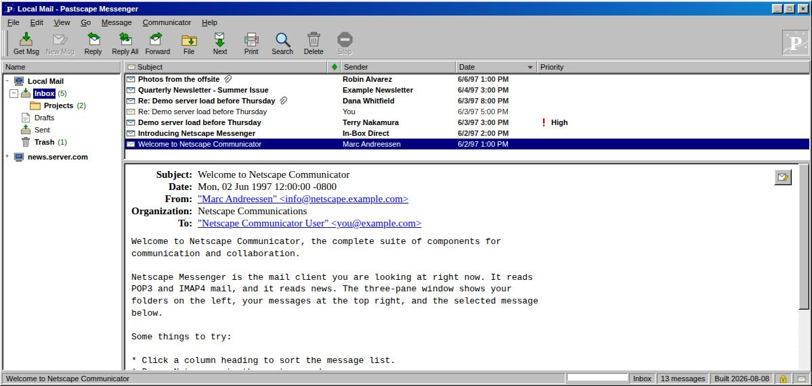
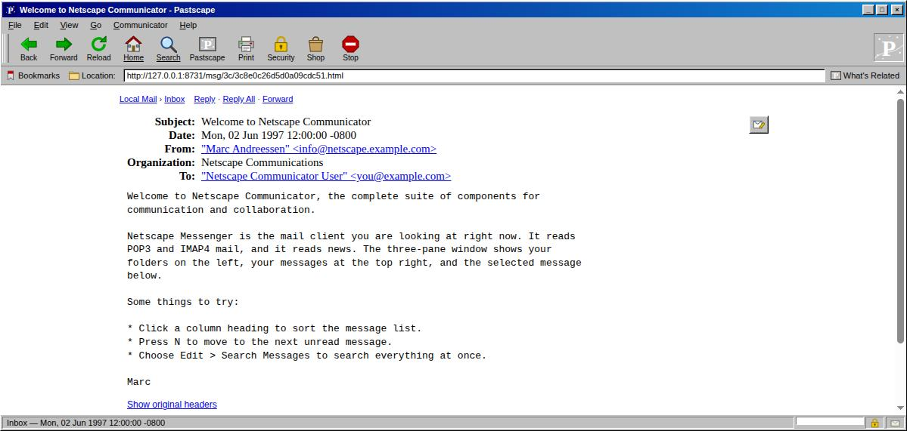

# Pastscape

Turns a PST file or a folder of `.eml` files into a **static** email archive
that looks and behaves like Netscape Communicator 4's Messenger — three panes,
chunky bevels, MS Sans Serif, green arrows.

Everything after the build is plain files. No server, no database, no runtime:
drop the output directory on any static host (or open it over
`python3 -m http.server`) and it works.

```
pastscape build archive.pst -o site --title "Local Mail" --serve
```



## What it does

| | |
|---|---|
| **Sources** | PST/OST, folders of `.eml`/`.emlx`, Maildir, mbox — mix several in one build |
| **Search** | Client-side, over a sharded inverted index fetched on demand |
| **Reply** | `mailto:` to the original sender, with `Re:` subject, `In-Reply-To`, and the quoted body |
| **Incremental** | Re-run over a grown PST and only the new messages are written |
| **Threading** | View ▸ Threaded groups conversations by `References` |
| **Attachments** | Extracted to disk and linked; inline `cid:` images resolved |
| **Safety** | Message HTML is sanitised at build time; remote images blocked until asked for |
| **No-JS** | Every message is also its own page, in Navigator chrome |

## Install

Work inside a virtualenv. Once, to create it:

```bash
cd /home/jason/dev/email_archive
python3 -m venv .venv
.venv/bin/pip install -e '.[pst]'    # drop [pst] if you only have .eml/mbox
```

Then, in each new shell, activate it — that puts the `pastscape` command on
your `PATH`:

```bash
source .venv/bin/activate            # Windows: .venv\Scripts\activate
pastscape --version
pastscape build archive.pst -o site --serve
deactivate                           # when you're done
```

Your prompt gains a `(.venv)` prefix while it is active. If you'd rather not
activate anything, call the binary directly — it behaves identically:

```bash
.venv/bin/pastscape build archive.pst -o site --serve
```

Every command below assumes one of those two forms. `pip install -e` is an
editable install, so edits to `pastscape/` take effect immediately with no
reinstall.

PST support needs one of two backends, tried in that order:

1. **`libpff-python`** (provides the `pypff` module) — reads the file in
   process. Preferred: MAPI properties are available, so an item that lost its
   transport headers still yields a sender, a date and a body.
2. **`readpst`** (`apt install pst-utils`) — shelled out to, explodes the PST
   into `.eml` files in a temp directory, which are then read normally.

If neither is installed, `pastscape build x.pst` says so and names both
install commands rather than guessing at the format.

`.eml`, Maildir and mbox sources need nothing beyond the standard library.

## Usage

```bash
pastscape build SOURCE [SOURCE ...] -o site [options]

  -t, --title TEXT          archive title (title bar + folder tree root)
      --type KIND           force a reader instead of sniffing
      --folder-prefix PATH  nest everything under e.g. "Archive 2004"
      --no-year-folders     put Inbox/Sent at the root instead of grouping by year
      --account ADDRESS     give this address a mailbox tree of its own (repeatable)
      --no-account-folders  do not split the tree by recipient address
      --news-host HOST      decorative news server in the tree, like the original
      --prune               delete pages for messages no longer in the sources
      --force               rewrite every page (keeps first-seen dates)
      --allow-remote-images do not block remote images in message bodies
      --limit N             stop after N messages, for a quick look
      --serve [--port N]    serve the result when the build finishes

pastscape info site         what is published, per folder
pastscape detect SOURCE     which reader would handle this
pastscape serve site        preview an already-built archive
```

### The folder tree

Each mailbox gets a root tree of its own, the way Communicator showed
"Local Mail" and "news.server.com" side by side. Inside a mailbox the tree is
one folder per year, newest first, back to the oldest message:

```
jason@example.com          ← one root per recipient address
  2026        Inbox  Sent  Trash
  2025        Inbox  Sent  Trash
  …
  2006        Inbox  Sent
dineane@example.com
  2011        Inbox
```

**Which mailbox a message belongs to** is worked out from, in order: the
delivery headers a server writes (`Delivered-To`, `X-Original-To`,
`Envelope-To`), the sender for anything in Sent or Drafts, and only then `To:`.
`To:` is the weakest signal — list mail is addressed to the list, and bcc'd
mail may not mention you at all — but old mail often carries nothing better.

Inference is deliberately conservative. An address has to account for at least
2% of the archive (minimum 3 messages) before it earns a root, so a list you
were on for a decade does not sprout one; anything below that is gathered under
`Other Recipients`. When a single address dominates, everything goes under it
rather than splitting off a handful of oddities.

Name your addresses explicitly with `--account` when the guess is wrong — a
message then belongs to a mailbox if *any* of its addresses (To, Cc, From,
Reply-To or a delivery header) matches:

```bash
pastscape build old.pst work.pst -o site \
    --account jason@example.com --account jason@work.example.com
```

`--no-account-folders` puts the years back at the root.

A message's year comes from its `Date:` header; anything undated lands in an
`Undated` folder that sorts after every year. Years with no mail at all get no
folder — the range is bounded by the oldest and newest message, not filled in.

Mailbox and year folders hold no messages themselves, so clicking one opens the
branch rather than dead-ending on an empty list. Only the most recent year in
each mailbox starts expanded: a twenty-year archive runs to 80-odd folders, and
rendering them all at once is unreadable. Mailbox roots always stay open, and
everything that navigates — selecting a folder, opening a deep link, jumping to
a search hit — expands whatever branch it lands in. A collapsed branch shows the
unread count of everything beneath it.

Pass `--no-year-folders` for the flat shape, with Inbox and Sent at the root.

### Merging sources

Sources are merged into one archive and de-duplicated by content identity, so
a PST that overlaps an old `.eml` export does not produce two copies:

```bash
pastscape build old-export/ 2004.pst 2008.pst -o site
```

## Re-running against updated mail

This is the point of the manifest. Run the same command again after mail has
been added:

```
Pastscape: 1 284 messages in 9 folders, 12 new, 2 updated, 1 270 unchanged
```

How it decides:

- Every message gets a **content-addressed uid** — SHA-1 of its `Message-ID`
  when it has one, otherwise a fingerprint of date, sender, normalised subject,
  recipients and body. Stable across runs and across source formats, which is
  what makes "the same message, seen again" recognisable.
- `manifest.json` at the site root records each uid with a content hash, the
  page it was written to, its attachments, and when it was **first seen**.
- A message is rewritten only if it is new, its content hash changed, or its
  prev/next neighbours moved. Nothing else is touched.
- Messages that disappear from the source are **kept** by default — an archive
  is normally additive. `--prune` removes them.
- If a run reads **zero** messages while the site already has some, the build
  **refuses to write anything**. A source that suddenly comes back empty is
  almost always a corrupt file or a mistyped path, and rewriting the listings
  then would blank a working archive and orphan its message pages. `--prune`
  is the way to say you meant it.

`manifest.json` is a cache, not the record. Every published message page
carries its own metadata block:

```html
<script type="application/json" id="ps-meta">
{"uid":"401c3a8df597c7b40b3e","folder":"Inbox","subject":"…","hash":"e0f1…",
 "first_seen":"2026-08-08T19:22:53+00:00","messageId":"welcome@…", …}
</script>
```

So if the manifest is lost — deleted, or the site was copied without it —
Pastscape rebuilds it by reading the pages back, and the next run is still
incremental. `pastscape info` on a manifest-less site does the same.

## Output layout

```
site/
  index.html                  Messenger application shell
  manifest.json               incremental build state
  assets/                     pastscape.css, pastscape.js, icons.svg
  data/
    folders.json              folder tree, counts, unread counts
    msgs/<slug>.json          one compact row tuple per message
    search/meta.json          shard directory
    search/<prefix>.json      inverted index shard
    search/docs.json          docId -> [folder slug, row index]
  msg/<ab>/<uid>.html         one page per message
  attachments/<ab>/<uid>/…    extracted attachment blobs
```

Message bodies live in exactly one place: the message pages. The Messenger
client fetches the page and lifts `#ps-article` out of it, rather than keeping
a second copy of every body in JSON.

## How search works

An archive can be large and the host is dumb, so the index is split by token
prefix. `meta.json` lists the shards; typing `andreessen` fetches
`data/search/an.json` and nothing else.

Postings are delta-encoded pairs of `(docIdDelta, fieldMask)`. The field mask
is what lets the client rank a subject hit above one buried in a quoted reply:

| bit | field |
|-----|-------|
| 1 | subject |
| 2 | sender / organization |
| 4 | recipients |
| 8 | body |
| 16 | attachment filename |

Multiple words intersect. The last word also matches by prefix, so `andree`
finds `andreessen`. Dotted tokens are indexed whole *and* in pieces —
`whiteboard.gif` is findable as `whiteboard`, as `gif`, and in full.

## Reply, forward, and the mailto: contract

Pastscape never sends anything. Reply builds a `mailto:` URL and hands it to
whatever the reader's system opens for mail:

- **Reply** → the `Reply-To` address, else the sender.
- **Reply All** → adds the original `To` recipients, and `Cc` as cc.
- **Forward** → no recipient, original headers reproduced in the body.
- Subject gets `Re:`/`Fwd:` unless it already has one, `In-Reply-To` is set,
  and the quoted body is capped at ~1.4 KB so the URL stays inside what mail
  clients actually accept.

The same links are baked into the static message pages, so reply works with
scripting off. Those pages carry Navigator chrome rather than Messenger's, and
are what a deep link, a bookmark or a search engine sees:



## Safety

Message HTML is the only untrusted input in the whole site, and it is rewritten
at build time, not left for the browser to sort out:

- Allow-list of tags and per-tag attributes; `<script>`, `<style>`, `<iframe>`,
  `<object>` and friends are dropped along with their contents.
- Every `on*` handler removed; only `http/https/mailto/ftp/news/tel/cid` URL
  schemes survive, so `javascript:` links cannot exist.
- Inline `style` is filtered to a handful of harmless declarations.
- Remote images are parked in `data-ps-src` behind a "Show Images" bar, which
  keeps tracking pixels from firing when you browse an old inbox.
  `--allow-remote-images` turns this off.
- Outbound links get `rel="noopener noreferrer nofollow"`.

Read/unread marks you make while browsing are stored in `localStorage`; the
published files are never modified.

## Keyboard

| key | |
|---|---|
| `↑` `↓` `PgUp` `PgDn` `Home` `End` | move through the message list |
| `N` | next unread |
| `R` / `Shift+R` | reply / reply all |
| `Enter` | open the message in its own window |
| `Ctrl+F` | search |
| `Esc` | close dialog |

Columns sort by click and resize by dragging their edge; the pane splitters
drag too.

## Development

With the venv from [Install](#install) active:

```bash
pip install pytest
pytest tests/ -q

# build the demo corpus and look at it
python tests/make_sample.py /tmp/mail
pastscape build /tmp/mail -o /tmp/site --news-host news.server.com --serve
```

`tests/make_sample.py` writes a small 1997-flavoured corpus: a thread with
quoted replies, an HTML newsletter carrying a tracking pixel and a
`javascript:` link, messages with attachments, a draft, and something in the
Trash.

### A note on the PST tests

`tests/test_pst.py` drives the pypff conversion path against a stub that
mimics the binding's surface, including its habit of raising `IOError` for
absent properties. That covers the mapping logic — headers vs. MAPI fallback,
Exchange X.500 addresses, attachments, RTF bodies, root-folder flattening —
but **not** libpff's own parsing, because no real PST file was available to
test against. Point it at a real PST before trusting it with an archive that
matters.

## Icons and branding

The icon set is drawn from scratch in the spirit of the Communicator 4
toolbar — saturated green arrows with hard drop shadows, cream envelopes,
manila folders — and shipped as one inline SVG sprite
(`pastscape/assets/icons.svg`) so the archive works from `file://` too. The
branding is Pastscape; no Netscape artwork or trademarks are included.
